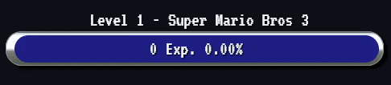

# SE Cumulative Exp Goal Bar Widget
 A widget for Stream Elements that tracks combined donation methods towards incentives via levels and exp.

    Suggested Dimensions: 600 x 90 px

Features:

- Combined donation/support total
- Custom goal values per level
- Custom text display
- Adjustable donation/support values. (exp)
- Customizable size, colors, font, and shape
- Level Up visual effect and Sound (optional)
- Animated progress bar

Currently supports:

- Twitch subscriptions, gift subscriptions, and cheers (bits)
- Stream Elements donations (tips).

##### Want More?
If you like this project, found it useful, or simply would like to see me create more. Please consider offering me some support as it greatly helps me continue working on projects like this. You can even submit requests! Thank You!

## How it works

In the widget editor you set the "exp" value of each individual donation type such as a Twitch subscription. For each donation that occurs the amount will be multiplied by their value then added to the total.

Example: 5 tier 1 gift subs at the default 6 points per sub would add 30 exp.

Twitch Tier Value Multipliers
Prime & Tier 1: None
Tier 2: 2 * point value
Tier 3: 3 * point value

By default each level (incentive goal) is the Total Points Goal divided equally by the desired number of levels.
(per level goal = Total Points / Levels)

#### Comma Separated Goals
However individual goals may be customized by using CSV (comma separated values).

For example if you wanted the following goals:
1. Level 1 - 50 exp to play Super Mario Bros.
2. Level 2 - 100 exp to play Marbles.

Total Points Goal would be: 150
CSV Incentive Names: Super Mario Bros,Marbles
CSV Incentive Points Values: 50,100

#### Disabling Certain Donations
To disable individual types from counting simply set their point value to 0.

#### Automatically Saved
The goal progress is automatically saved. However if there are any issues you can manually set the current exp progress value by entering the target value in the Overrides section, **saving the overlay**, then clicking the Set Progress button.

## How to Setup
1. On your StreamElements dashboard go to Streaming tools > Overlays.
2. Edit an existing or add a new Overlay
3. Add a Custom Widget from the Blue (+) > Static/Custom > Custom Widget
4. Select the new widget on the grid.
5. In the sidebar under the Settings dropdown open the Editor.
6. Replace each tabs (html, css, js, fields) entire contents with the corresponding files contents.
7. Done, Save

If you need more help visit the [StreamElements official documentation](https://dev.streamelements.com/docs/widgets/3cf52461e4e34-before-starting).

